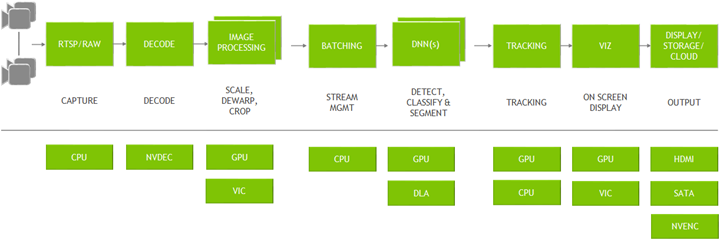

<h1 align="center">NVIDIA DeepStream </h1>

    
Công cụ hỗ trợ xây dựng các ứng dụng AI, giúp truyền tải các luồng video từ file, camera usb/csi hoặc từ luồng RTSP. Nhằm tích hợp các thuật toán, mô hình Computer Vision để phân tích các luồng video

    

> [DeepStream Documentation](https://docs.nvidia.com/metropolis/deepstream/6.0/dev-guide/text/DS_Overview.html#nvidia-deepstream-overview)

- Hỗ trợ Python và C/C++
- Lõi của SDK sử dụng các bộ tăng tốc phần cứng của NVIDIA như `VIC`, `GPU`, `DLA`, `NVDEC`, `NVENC`.
- Xây dựng dựa trên các thư viện của NVIDIA từ các CUDA-X, gồm các công cụ: CUDA, TensorRT, NVIDIA Triton Inference và các thư viện da phương tiện.
- Tối ưu trên các GPU NVIDIA, từ thiết bị nhúng Jetson tới các Data Center. Xây dựng ứng dụng thành các Contaner và chạy trên `NVIDIA Container Runtime`

# **Sơ đồ kiến trúc của DeepStream**
DeepStream có nhiều khối xây dựng từ plugin GStreamer. Người dùng có thể tùy chỉnh để xây dựng lên Pipeline xử lý ảnh.

Ví dụ:

    

- Đầu vào là các luồng hình ảnh từ camera thông qua stream RTSP. CPU sẽ đọc và lưu vào Memory.
- Sau đó dược gửi đến `NVDEC Accelerator` để DECODE.
- Tiếp theo, hình ảnh được đưa vào bộ xử lý trước khi suy luận, chúng có thể được xoay, làm cong, chuyển không gian màu, v.v. Quá trình này sử dụng `GPU` hoặc `VIC`.
- Tiếp theo, các frame được xếp thành `Batch` và đưa vào các mô hình suy luận. Các mô hình suy luận có thể thực hiện bằng `TensorRT` hoặc TensorFlow/PyTorch với `Triton`. Về phần cứng, các mô hình chạy trên `GPU` hoặc `DLA`.
- Kết quả của suy luận được gửi đến phần `Tracker`. Để theo dõi các đối tượng.
- Phần 'Vizualize' hiển thị trực quan kết quả suy luận trên màn hình.
- Phần cuối cùng là Output của Pipeline. Kết quả có thể được lưu trữ trên bộ nhớ, truyền tải lên Cloud hoặc làm đầu vào cho các thuật toán điều khiển khác.

# **[Tham khảo app DeepStream](https://docs.nvidia.com/metropolis/deepstream/6.0/dev-guide/text/DS_ref_app_deepstream.html)**
- DeepStream SDK cung cấp các mã tham khảo, có thể cấu hình lại để thay đổi các nguồn cấp video, mạng suy luận video.
- Chúng là các end-to-end app gọi là deepstream-app.

> `end-to-end` là thuật ngữ liên quan đến các mô hình, hệ thống làm mọi việc từ a->z, người dùng chỉ cần cấp đầu vào và nhận đầu ra.
> Ví dụ, chúng ta cấp luồng video RTSP và nhận lại kết quả suy luận, mọi thứ xử lý được làm hết bên trong Piple của DeepStream.

    

# **Bắt đầu xây dựng một ứng dụng DeepStream**

    

Để bắt đầu với DeepStream, hãy xem qua các app mẫu về nó. 

> [Github DeepStream Apps Test](https://github.com/NVIDIA-AI-IOT/deepstream_python_apps)

- *DeepStream App Test1*: Giống như một app Hello World với DeepStream. Học cách xây dựng DeepStream Pipeline với các Plugins. Lấy vào một video từ một file, deoce, batch và nhận dạng đối tượng và hiển thị lên màn hình.
- *DeepStream App Test2*: Phát triển từ app-test1, chuyển từ mạng thứ cấp sang mạng chính.
- *DeepStream App Test3*: Thử vối nhiều luồng video cùng lúc.
- *DeepStream App Test4*: Tishc hợp với các dịch vụ IoT bằng `message broker plugin`

# **Xây dựng DeepStream app với Python**

    

