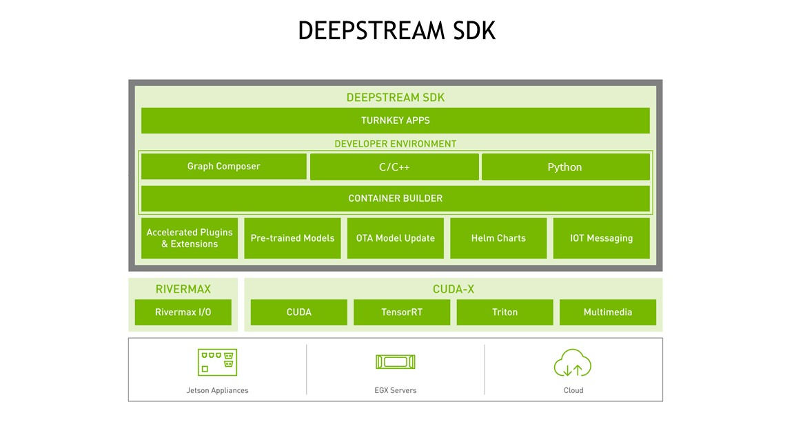

<h1 align="center">NVIDIA DeepStream </h1>

    
Công cụ hỗ trợ xây dựng các ứng dụng AI, giúp truyền tải các luồng video từ file, camera usb/csi hoặc từ luồng RTSP. Nhằm tích hợp các thuật toán, mô hình Computer Vision để phân tích các luồng video

    

> [DeepStream Documentation](https://docs.nvidia.com/metropolis/deepstream/6.0/dev-guide/text/DS_Overview.html#nvidia-deepstream-overview)